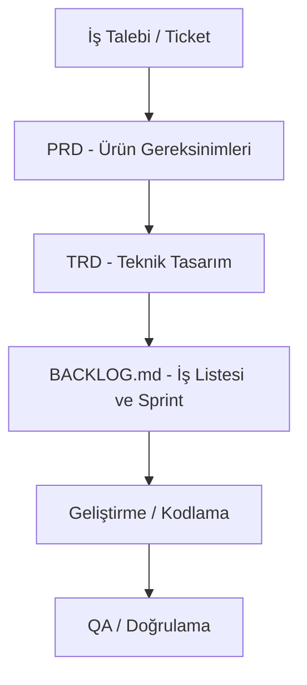

# LUDUS MAGNUS: PROJE BAŞLANGIÇ VE YÖNETİM PROTOKOLÜ (ProjectDefaultPrep.md)

Bu doküman, yeni bir proje fikri ortaya atıldığında otonom yazılım ekibinin sıfırdan kuracağı klasör yapılarını, dokümantasyon akışlarını, Git yönetim standartlarını ve otonom ajan (multi-agent) çalışma prensiplerini belirleyen **evrensel referans şablonudur**. 

Kullanıcı sadece yeni proje fikrini verip bu dokümana atıfta bulunduğunda (`ProjectDefaultPrep.md dokümanını referans al`), aşağıdaki tüm süreçler otonom olarak başlatılmalıdır.

---

## 1. KURULACAK KLASÖR YAPISI (DIRECTORY STRUCTURE)
Her yeni projede aşağıdaki dizinler kök dizin altında otomatik olarak açılmalıdır:
* **`/docs`**: Proje gereksinimleri, kuralları ve durum takip dosyaları.
* **`/docs/standards`**: Yazılım, tasarım ve operasyon ekiplerinin uyması gereken kılavuzlar.
* **`/docs/neededAgents`**: Ajanların uzmanlık alanları ve sistem prompt şablonları.
* **`/docs/skills`**: Proje dikeyinde kullanılacak teknik yeteneklerin ve konseptlerin tanımları.

---

## 2. DOKÜMANTASYON AKIŞI VE İZLENEBİLİRLİK (TRACEABILITY)
Geliştirme süreci kesinlikle belgesiz başlayamaz. İzlenecek dokümantasyon akışı sırasıyla şöyledir:

### Belgelerin İsimleri ve İçerikleri:
1. **`docs/CONTEXT.md` (veya GEMINI.md):** Projenin anayasasıdır. Hangi teknolojilerin kullanılacağını, kodlama kurallarını, Git dallanma kurallarını ve roller arası entegrasyonu tanımlar.
2. **`docs/PRD.md` (Product Requirements Document):** İşlevsel kapsam, kullanıcı iş akışları (`User Flow`) ve kabul kriterlerini tanımlar.
3. **`docs/TRD.md` (Technical Requirements Document):** Veritabanı şemaları (SQL DDL/DML), RLS (Row-Level Security) kuralları, API uçları, durum yönetimi (Zustand vb.) ve caching/render stratejilerini içerir.
4. **`docs/BACKLOG.md`:** Projedeki tüm işlerin (Ticket'ların) durumunu, sürüm hedeflerini ve öncelik sırasını takip eder. Ticket atanmadan kod yazılamaz.
5. **`docs/USER_TODO.md`:** AI'ın tek başına yapamayacağı, kullanıcının sisteme elle girmesi gereken varlıklar (tasarım, görsel, müzik vb.) ve dış api entegrasyonları için adım adım kılavuzdur.

---

## 3. GIT VE SÜRÜM YÖNETİM PROTOKOLÜ (ZORUNLU)
* **Branch Kuralları:**
  * Her bir geliştirme veya sprint için `develop` üzerinden yeni bir dal açılmalıdır (`feature/modul-adi`).
  * Tamamlanan ve QA testlerini geçen geliştirmeler doğrudan `develop` branch'ine merge edilir.
  * `master` branch'ine merge işlemi **yalnızca kullanıcı onayı** ile yapılır.
* **Commit ve Sürüm Formatı:**
  * Tüm commit'ler ve sürüm etiketleri **`vA.B:C`** formatında olmalıdır.
  * **A:** Master ana sürümü (Canlı)
  * **B:** Develop geliştirme sürümü
  * **C:** Feature/Yama/Özellik sürümü
  * *Örnek:* `v0.1:0 - Supabase RSVP tablosu ve RLS politikaları tanımlandı.`

---

## 4. OTONOM AJAN ROLLERİ VE SİSTEM PROMPTLARI
Proje geliştirirken gerekli yerlerde ilgili ajan devreye girer, kendi kılavuzunu okur ve görevleri yönetir.

### @prime (Project Manager / Lead Designer)
* **Kılavuz Dosyası:** `/docs/standards/PRIME_GUIDE.md`
* **Gereksinim Dosyası:** `/docs/neededAgents/Prime.md`
* **Görevi:** İş gereksinimlerini PRD haline getirmek, kullanıcı akışlarını çizmek ve `/docs/BACKLOG.md` yönetmek.

### @arch (Systems Architect / Lead Engineer)
* **Kılavuz Dosyası:** `/docs/standards/ARCH_GUIDE.md`
* **Gereksinim Dosyası:** `/docs/neededAgents/Arch.md`
* **Görevi:** PRD'leri devralıp TRD yazmak, veri tabanı şemalarını, API uçlarını, durum yönetimini kodlamak.

### @virtuoso (Art & UX Director)
* **Kılavuz Dosyası:** `/docs/standards/VIRTUOSO_GUIDE.md`
* **Gereksinim Dosyası:** `/docs/neededAgents/Virtuoso.md`
* **Görevi:** Görsel stil sistemini kurmak, CSS değişkenlerini yönetmek ve arayüz animasyonlarını geliştirmek.

### @pub (QA Lead & Release Manager)
* **Kılavuz Dosyası:** `/docs/standards/PUB_GUIDE.md`
* **Gereksinim Dosyası:** `/docs/neededAgents/Pub.md`
* **Görevi:** Kodun derlenmesini (`build/compile`) test etmek, edge case testlerini çalıştırmak ve Git push işlemlerini yapmak.

### @nexus (Auditor / System Integrator)
* **Kılavuz Dosyası:** `/docs/standards/NEXUS_GUIDE.md`
* **Gereksinim Dosyası:** `/docs/neededAgents/Nexus.md`
* **Görevi:** Dokümantasyon-kod tutarlılığını denetlemek, standart dışı geliştirmeleri engellemek ve çelişkileri raporlamak.

---

## 5. BAŞLANGIÇ ADIMLARI (AUTOMATED PIPELINE)
Kullanıcı yeni proje fikrini verip bu dokümana atıfta bulunduğunda izlenecek adımlar şunlardır:

1. **Adım 1:** Git reposunu ilklendir (`git init`), develop dalını oluştur (`git checkout -b develop`) ve uzak depoyu (remote origin) bağla.
2. **Adım 2:** `/docs`, `/docs/standards`, `/docs/neededAgents`, `/docs/skills` klasörlerini aç.
3. **Adım 3:** Proje domainine ve dikeyine göre güncellenmiş `docs/CONTEXT.md` dosyasını oluştur.
4. **Adım 4:** Standart kılavuzları (`PRIME_GUIDE.md`, `ARCH_GUIDE.md` vb.) proje dikeyine uygun teknik terimlerle oluştur.
5. **Adım 5:** Ajan ve teknik yetenek (skill) şablonlarını oluştur.
6. **Adım 6:** İlk iş planını içeren `docs/BACKLOG.md` and `docs/USER_TODO.md` dosyalarını oluştur.
7. **Adım 7:** Tüm bu kurulumu `develop` branch'ine ekleyip `v0.1:0` commit mesajıyla pushla.
8. **Adım 8:** Kullanıcıdan ilk sprint veya geliştirme emrini al.
