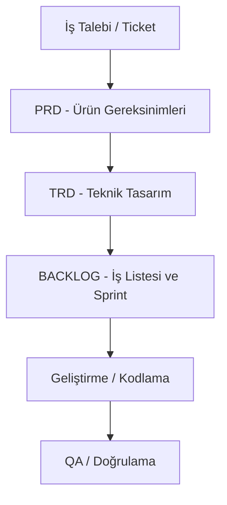

# LUDUS MAGNUS SYSTEM CONTEXT

Bu doküman, **la-vie-digital** (Dijital Davetiye Platformu) projesinin geliştirme, dokümantasyon ve operasyonel süreçlerini belirleyen en üst düzey anayasadır. Projedeki tüm otonom ajanlar ve geliştiriciler bu kurallara uymakla yükümlüdür.

---

## 1. PROJE KAPSAMI VE MİMARİ
Proje, dijital davetiye dikeyinde iki temel iş modelini barındırır:
1. **Manuel Premium Model:** Figma şablonlarının elle özelleştirildiği ve müşteri adına özel subdomain (`ciftadi.davetiyem.com`) ile yayınlandığı yüksek hizmet seviyeli model.
2. **SaaS Standart Model:** WYSIWYG editörü ile kullanıcının kendi içeriğini ürettiği, dinamik slug (`davetiyem.com/ciftadi`) kullanan ve CDN katmanında ISR (Incremental Static Regeneration) ile anında statik HTML derleyen tam otomatik model.

### Teknoloji Yığını (Tech Stack)
* **Framework:** Next.js (App Router)
* **Veri Tabanı & Güvenlik:** Supabase (PostgreSQL) + RLS (Row-Level Security)
* **Durum Yönetimi:** Zustand
* **CSS:** Vanilla CSS (Maksimum performans ve özelleştirme kontrolü için)
* **Hedef TTFB:** <200ms (ISR ve CDN önbellekleme stratejileri ile)

---

## 2. DOKÜMANTASYON SÜRECİ VE İZLENEBİLİRLİK (TRACEABILITY)
Geliştirme süreci kesinlikle belgesiz başlayamaz. İzlenecek dokümantasyon zinciri sırasıyla şöyledir:

### Belgelerin Tanımları
1. **PRD (Product Requirements Document):** İşlevsel kapsamı ve kullanıcı iş akışlarını (`User Flow`) belirler. `/docs` dizininde ilgili modül adına göre oluşturulur.
2. **TRD (Technical Requirements Document):** Tablo şemalarını, RLS politikalarını, API uçlarını, durum yönetim stratejisini ve performans hedeflerini tanımlar.
3. **BACKLOG.md:** Projedeki tüm işlerin durumunu ve öncelik sıralamasını içerir.
4. **USER_TODO.md:** Tasarım, müzik veya manuel veri ekleme gibi insan gücü gerektiren adımların listelendiği dokümandır.

---

## 3. GIT VE SÜRÜM YÖNETİM PROTOKOLÜ (ZORUNLU)
* **Uzak Depo:** `git@github.com:Msenelll/Project_Invite.git`
* **Branch Protokolü:**
  * Her bir geliştirme veya sprint için `develop` üzerinden yeni bir dal açılmalıdır. (`feature/modul-adi`)
  * Tamamlanan ve test edilen geliştirmeler doğrudan `develop` branch'ine merge edilir.
  * `master` branch'ine merge işlemi **yalnızca kullanıcı onayı** ile yapılır.
* **Commit ve Versiyon Biçimi:**
  * Commit mesajları ve etiketleri kesinlikle `vA.B:C` formatında olmalıdır.
  * **A:** Ana sürüm (master)
  * **B:** Geliştirme sürümü (develop)
  * **C:** Özellik/Yama sürümü (feature)
  * *Örnek:* `v0.1:0 - Supabase RSVP tablosu ve RLS politikaları tanımlandı.`

---

## 4. OTONOM AJAN ROLLERİ (LUDUS MAGNUS AI TEAM)
Geliştirme sürecinde farklı uzmanlıklara sahip 5 ana rol tanımlanmıştır:
1. **@prime (Product Manager):** PRD dokümanlarını hazırlar ve `/docs/BACKLOG.md` yönetir.
2. **@arch (Systems Architect):** TRD dokümanlarını hazırlar, veritabanı şemalarını ve Next.js mimarisini tasarlar.
3. **@virtuoso (Art & UX Director):** Görsel tasarım standartlarını, animasyonları ve WYSIWYG arayüz mantığını kurar.
4. **@pub (QA Lead & Release Manager):** Test senaryolarını işletir, build süreçlerini ve deploy doğrulamalarını yönetir.
5. **@nexus (Auditor):** Kod ile dokümantasyon arasındaki tutarlılığı ve standartlara uyumu denetler.
