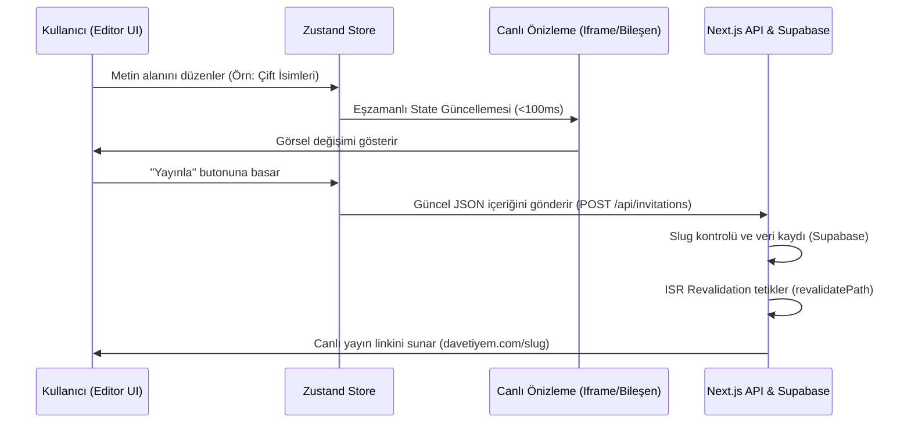

# PRD: SaaS WYSIWYG Editörü & Zustand Durum Yönetimi
**Ticket ID:** TCK-200  
**Yazar:** `@prime`  
**Durum:** Hazırlanıyor  

---

## 1. İŞLEVSEL KAPSAM (FUNCTIONAL SCOPE)
SaaS WYSIWYG (Ne Görüyorsan Onu Alırsın) editörü, standart kullanıcıların kod yazmadan veya karmaşık tasarım araçları kullanmadan kendi dijital davetiyelerini oluşturmasını, kişiselleştirmesini ve canlıya almasını sağlayan görsel düzenleme panelidir.

### Temel Özellikler (Core Features)
1. **Canlı Önizleme (Live Preview):** Sol taraftaki yönetim paneli üzerinden girilen her türlü metin, tarih, resim URL'si ve ayar değişikliği, sağ taraftaki davetiye önizleme ekranında anında (real-time, <100ms gecikme ile) güncellenmelidir.
2. **Şablon/Tema Seçici (Theme Selector):** Kullanıcı, önceden hazırlanmış premium Vanilla CSS temaları arasından seçim yapabilmeli ve tema değiştiğinde tüm yazı tipleri, renkler ve düzenler anında önizlemeye yansımalıdır.
3. **Bölüm Yönetimi (Section Toggle & Reorder):** Kullanıcı davetiyesindeki bölümleri (Giriş Ekranı, Hikayemiz, Galeri, Harita/Konum, LCV Formu) aktif/pasif hale getirebilmeli ve sıralamasını değiştirebilmelidir.
4. **Medya & Fon Müzik Yönetimi:** Davetiyeye çift fotoğrafları yüklenebilmeli ve arka planda çalacak hazır fon müziklerinden biri seçilebilmelidir.
5. **Yayınlama Modülü (Publishing):** Davetiyeyi kaydetme ve yayınlama butonları bulunmalıdır. Yayınlandığında dinamik slug (`davetiyem.com/[slug]`) üzerinden statik HTML üretimi tetiklenmelidir.

---

## 2. KULLANICI İŞ AKIŞI (USER FLOW)

### İş Akışı Adımları:
1. **Adım 1:** Kullanıcı kontrol paneline giriş yapar ve "Davetiyemi Düzenle" butonuna tıklar.
2. **Adım 2:** Editör arayüzü yüklenir. Sol panelde form alanları (Gelin/Damat ismi, Tarih, Mekan, Harita Pin, RSVP Ayarları), sağ panelde ise mobil boyutlu davetiye simülatörü görünür.
3. **Adım 3:** Kullanıcı Gelin alanına "Ayşe", Damat alanına "Ahmet" yazdığı anda sağdaki simülatörün başlığı "Ayşe & Ahmet" olarak güncellenir.
4. **Adım 4:** Kullanıcı "Müzik Seçimi" dropdown menüsünden bir şarkı seçer. Önizlemedeki oynatıcı şarkıyı yükler.
5. **Adım 5:** Kullanıcı davetiyenin yayınlanacağı adresi (slug: `ayse-ahmet-evleniyor`) belirler ve "Yayınla" tuşuna basar.
6. **Adım 6:** Davetiye yayına alınır ve statik HTML olarak ISR ile derlenir.

---

## 3. KABUL KRİTERLERİ (ACCEPTANCE CRITERIA)
* **AC-1 (Performans):** Editör paneli girişlerindeki karakter güncellemeleri önizleme ekranında takılmaya sebep olmamalı, Zustand store güncellemeleri optimize edilmelidir (Debounce gerekirse sadece ağır işlemler için uygulanmalıdır).
* **AC-2 (Mobil Uyumluluk):** Editör arayüzü masaüstü ekranlarda yan yana (Yönetim | Önizleme) çalışırken, mobil ekranlarda "Düzenleme Modu" ve "Önizleme Modu" sekmeli olarak ayrılmalıdır.
* **AC-3 (Güvenlik):** Kullanıcı sadece kendi `user_id` alanına ait davetiyeleri düzenleyip kaydedebilmelidir (Bu durum API katmanında doğrulanacaktır).
* **AC-4 (Veri Yapısı):** Editördeki tüm dinamik ayarlar Supabase'deki `content` jsonb kolonunda kaybolmaksızın ve şema değişikliğine gerek kalmaksızın saklanabilmelidir.
* **AC-5 (ISR Tetikleme):** Başarıyla kaydedilen her yayındaki davetiye için revalidate API'si çağrılarak statik sayfa güncellenmelidir.
